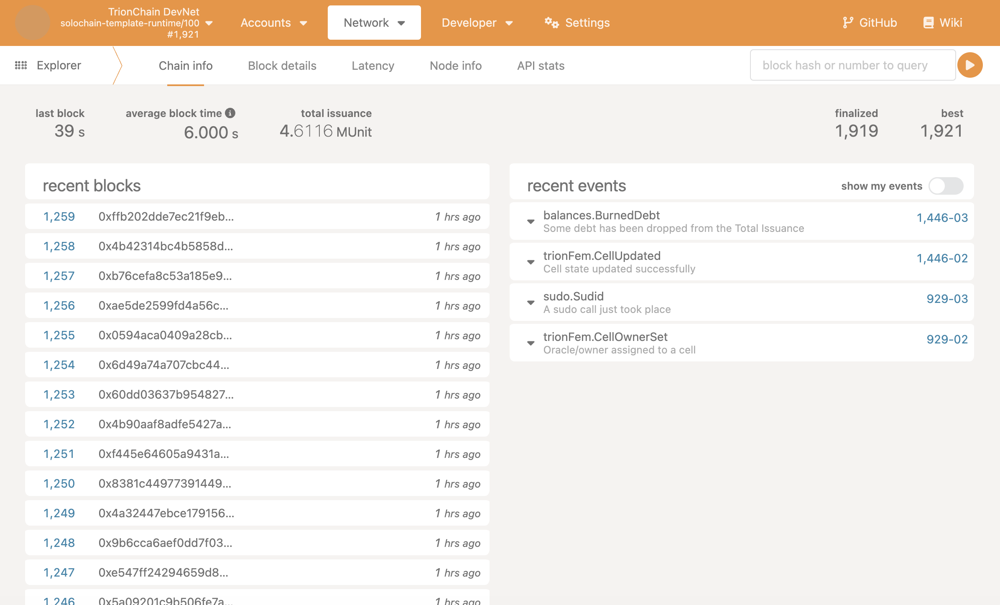
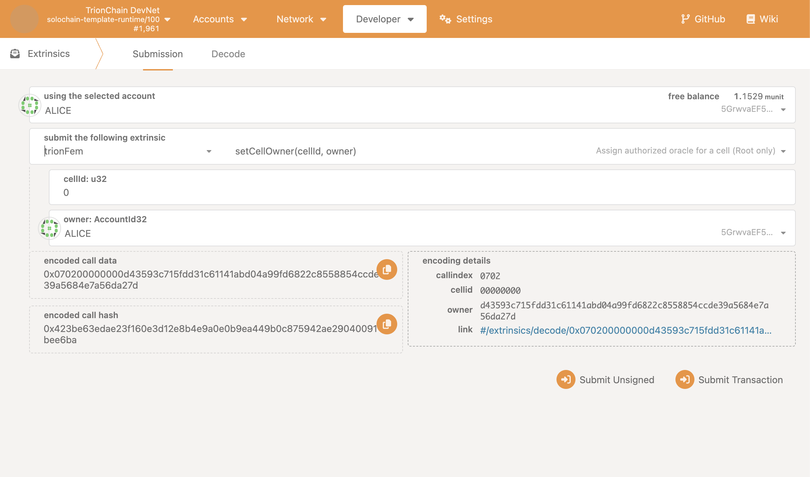
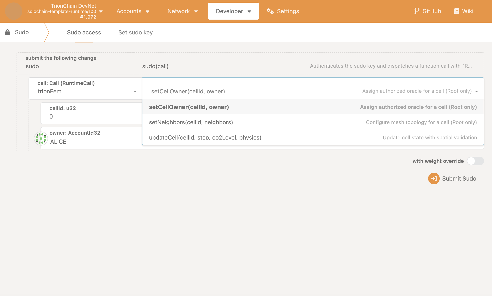

# TrionChain DevNet – Live Runtime Demonstration

This document demonstrates a live execution of the **TrionChain DevNet**, showcasing
a custom FEM-inspired pallet (`trionFem`) deployed and operating on-chain.

---

## 1. Network Status (TrionChain DevNet)

---

## 2. trionFem Pallet – Extrinsics

---

## 3. trionFem Pallet – Root (Sudo)

---

## Result

This demo proves:
- Live block production
- Custom runtime pallet integration
- Root and non-root calls
- Deterministic on-chain FEM-style state updates
